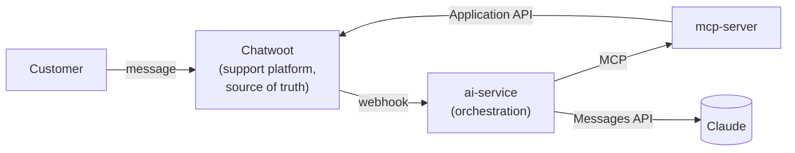

# AI-Augmented Customer Support Platform

A portfolio-quality demonstration of a self-hosted customer support platform for any product or
company: **Chatwoot Community Edition** as the support system of record, plus a separate **AI
orchestration** layer that calls **Claude** and reaches Chatwoot only through a self-hosted
**MCP server**. Humans stay in control of every customer-facing response. The demo dataset is a
deliberately generic, fictional SaaS product (company: **ExampleCo**) — see
[knowledge-base/](knowledge-base/) — chosen specifically so nothing here is tied to a real
product or company, and the whole dataset is trivial to swap for real content later.

See [docs/architecture.md](docs/architecture.md) for the full architecture,
[docs/ai-workflows.md](docs/ai-workflows.md) for the AI workflows,
[docs/mcp-server.md](docs/mcp-server.md) for the MCP tool reference,
[docs/setup.md](docs/setup.md) for local and cloud deployment, and
[docs/cost-estimate.md](docs/cost-estimate.md) for the cost breakdown. Implementation-level
decisions and their reasoning are recorded in
[docs/adr/0001-architecture-and-tech-stack.md](docs/adr/0001-architecture-and-tech-stack.md);
the running build log is in [PROJECT_JOURNAL.md](PROJECT_JOURNAL.md).

## Problem

Small support teams receive a steady stream of repetitive customer requests — crash reports,
"how do I," known-issue duplicates, the occasional spam ticket — but can't justify expensive
enterprise support/AI infrastructure to triage them.

## Solution

A self-hosted support platform (Chatwoot) with a separate, independently deployable AI/MCP
layer that augments human agents: it classifies incoming tickets, flags spam, drafts responses
for review, and summarizes support trends — without ever sending anything to a customer
automatically, and without Chatwoot or the MCP server knowing anything about the specific LLM
behind the classification.

## Architecture



The three pieces — Chatwoot, the AI orchestration layer, and the MCP server — are each
independently replaceable: Chatwoot could be swapped for another support platform, Claude for
another LLM, and the MCP server for a different implementation, without redesigning the others.
Full detail in [docs/architecture.md](docs/architecture.md).

## AI workflows

| Workflow | What it does |
|---|---|
| **Spam detection** | Classifies incoming conversations; spam is tagged and moved out of the active queue — never deleted. |
| **Categorisation** | Classifies into a configurable category set (Bug, Crash, Technical, Installation, Account, Performance, Billing, Feature Request, Feedback, Other, Spam) via tags + custom attributes. |
| **Reporting** | Answers questions like "what are the main support issues this week?" — raw Chatwoot data retrieval and Claude summarisation are kept as separate steps. |
| **Human escalation + draft** | Flags conversations needing a human, with a reasoning note; optionally drafts a suggested reply as a private, agent-only note — never auto-sent. |

Full detail, including error handling and idempotency, in
[docs/ai-workflows.md](docs/ai-workflows.md). Classification is grounded in real semantic search
over the knowledge base (`rag-mcp`: pgvector + local, zero-cost embeddings — see
[ADR 0006](docs/adr/0006-knowledge-base-rag.md)), and can optionally also be grounded against
real Jira and/or Azure DevOps issues (each independently optional) — see
[ADR 0004](docs/adr/0004-issue-tracker-grounding.md). QA/CS staff can add to that knowledge base
themselves — paste text or upload a `.md` file — through a small ingestion UI at `/ui`, with no
filesystem or MCP access required; see [ADR 0007](docs/adr/0007-knowledge-base-ingestion-ui.md).
Documents can reference each other with `[[wikilinks]]`, browsable as an actual graph at
`/ui/graph` (a related_documents MCP tool exposes the same relationships programmatically); see
[ADR 0008](docs/adr/0008-knowledge-base-at-scale.md) for how this scales toward a real, large
issue-tracker-backed knowledge base and the alternatives considered along the way.

## MCP server

`mcp-server/` exposes a small, curated tool set over Chatwoot (`get_conversation`,
`search_conversations`, `add_conversation_tag`, `create_draft_response`, `get_support_statistics`,
…) rather than the entire Chatwoot API — read and mutating tools are separated, and mutations
can be disabled entirely via one flag. It runs over stdio locally and over stateless Streamable
HTTP (no SSE, no server-side session) for networked deployments, including Google Cloud Run's
scale-to-zero model. Full tool reference and security model in
[docs/mcp-server.md](docs/mcp-server.md).

## Deployment

**Local:** `docker compose up -d` runs Chatwoot, Postgres, Redis, `mcp-server`, and scheduled
backups. `ai-service` (the automated webhook pipeline) is opt-in —
`docker compose --profile automated up -d` — since two other ways to run the same classification
logic don't need it at all: a CLI mode, or driving `mcp-server` directly from a connected Claude
Code session/routine. See [AI orchestration modes](docs/setup.md#ai-orchestration-modes) and
[ADR 0003](docs/adr/0003-ai-orchestration-deployment-modes.md).

**Cloud:** a single low-cost VM (Docker Compose + Caddy for automatic HTTPS) is the default
path; `mcp-server` and `ai-service` are also individually deployable to Google Cloud Run for
pay-per-request, scale-to-zero economics on the two custom services while Chatwoot stays on the
VM. See [docs/setup.md](docs/setup.md#cloud-deployment).

## Cost

| Path | Infra | Claude API | Total |
|---|---|---|---|
| Single VM (default) | $12–24/mo | <$5/mo | **~$15–30/mo** |
| VM + Cloud Run (mcp-server/ai-service) | $10–17/mo | <$5/mo | **~$15–22/mo** |

Chatwoot Community Edition itself is free. Full breakdown in
[docs/cost-estimate.md](docs/cost-estimate.md).

## Demo scenarios

1. **Spam** — a spam ticket is classified and tagged, never entering the normal queue.
2. **Bug** — *"The app crashes every time I export a report over 10,000 rows"* is classified as
   Bug/Crash, matched against a known issue, escalated to a human, and given an AI-drafted
   response an agent reviews before sending.
3. **Reporting** — *"What are the main support issues reported by customers this week?"* returns
   aggregated Chatwoot data plus an AI-generated summary.

Run `python scripts/run_demo.py` after setup to seed all three. See
[docs/setup.md](docs/setup.md#5-load-the-demo-scenario).

## Quickstart

```bash
git clone <this-repo> && cd <this-repo>
cp .env.example .env   # set ANTHROPIC_API_KEY, SECRET_KEY_BASE, MCP_AUTH_TOKEN, AI_WEBHOOK_SHARED_SECRET
docker compose up -d
```

Then follow [docs/setup.md](docs/setup.md) to create the first Chatwoot admin, register the
webhook, and load the demo.

## Repository layout

```
ai-service/        AI orchestration (FastAPI): webhook receiver, Claude client, workflows
mcp-server/        Self-hosted MCP server: Chatwoot tool abstraction
rag-mcp/           Self-hosted MCP server: semantic knowledge-base search + ingestion UI (docs/adr/0006, 0007)
backup/            Scheduled Postgres -> S3 backup/restore (docs/adr/0002)
knowledge-base/    "ExampleCo" (fictional product) FAQ, known issues, release notes, sample tickets
deployment/        Cloud Compose overlay (Caddy) and deployment notes
scripts/           Chatwoot configuration, demo seeding, backup/restore triggers
docs/              Architecture, AI workflows, MCP reference, setup, cost, ADRs
```

## Future extensions

Third-party account context (CRM, billing provider) · automatic duplicate bug detection ·
a QA MCP integration (customer report → known issue → regression test → bug tracker; see
[docs/architecture.md](docs/architecture.md#future-integration-direction-not-implemented)) ·
automatic reproduction-test generation · multilingual support · a human feedback loop on draft
quality (edited/accepted/discarded, not autonomy) · a real design-doc corpus for `rag-mcp`
beyond the demo `knowledge-base/` content (chunking would matter at that scale — see
[ADR 0006](docs/adr/0006-knowledge-base-rag.md)).

**Permanently out of scope, not just deferred:** any workflow where the AI sends something to a
customer directly, at any confidence level — see
[ADR 0005](docs/adr/0005-no-direct-ai-to-customer-interface.md). Every AI action in this project
lands as a tag, attribute, or private note for a human to act on; that boundary doesn't move.

## Status

Documentation, architecture, and implementation are complete and have been through a full
interactive test pass against a real Chatwoot instance (real admin account, real API token, real
inbox), not just automated tests: `mcp-server` (20 tests) and `ai-service` (21 tests) pass their
suites, and every demo scenario — spam, the bug/crash known-issue match with a grounded draft
response, and reporting — was run live end to end, both through the fully automated `ai-service`
webhook pipeline and by driving `mcp-server`'s tools directly from a connected Claude Code
session. That live pass caught six real cross-service bugs invisible to unit tests alone
(a Chatwoot SSRF protection blocking same-network webhooks, a message-type shape mismatch, an
uncaught auth-error exception type, a too-narrow MCP tool schema, label-replace-vs-merge
semantics, and a malformed multi-condition filter query) — all fixed, all covered by new
regression tests, all reverified live. Full account in
[PROJECT_JOURNAL.md, Milestone 2](PROJECT_JOURNAL.md).
