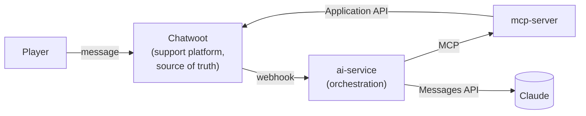

# AI-Augmented Game Support Platform

A portfolio-quality demonstration of a self-hosted game-player support platform: **Chatwoot
Community Edition** as the support system of record, plus a separate **AI orchestration**
layer that calls **Claude** and reaches Chatwoot only through a self-hosted **MCP server**.
Humans stay in control of every player-facing response. The demo dataset is a deliberately
generic, fictional game (called, on the nose, **Generic**) — see
[game-data/](game-data/) — chosen specifically so nothing here is tied to a real title or
studio and the whole dataset is trivial to swap for a real game's content later.

See [docs/architecture.md](docs/architecture.md) for the full architecture,
[docs/ai-workflows.md](docs/ai-workflows.md) for the AI workflows,
[docs/mcp-server.md](docs/mcp-server.md) for the MCP tool reference,
[docs/setup.md](docs/setup.md) for local and cloud deployment, and
[docs/cost-estimate.md](docs/cost-estimate.md) for the cost breakdown. Implementation-level
decisions and their reasoning are recorded in
[docs/adr/0001-architecture-and-tech-stack.md](docs/adr/0001-architecture-and-tech-stack.md);
the running build log is in [PROJECT_JOURNAL.md](PROJECT_JOURNAL.md).

## Problem

Small game studios receive a steady stream of repetitive player support requests — crash
reports, "how do I," known-issue duplicates, the occasional spam ticket — but can't justify
expensive enterprise support/AI infrastructure to triage them.

## Solution

A self-hosted support platform (Chatwoot) with a separate, independently deployable AI/MCP
layer that augments human agents: it classifies incoming tickets, flags spam, drafts responses
for review, and summarizes support trends — without ever sending anything to a player
automatically, and without Chatwoot or the MCP server knowing anything about the specific LLM
behind the classification.

## Architecture



The three pieces — Chatwoot, the AI orchestration layer, and the MCP server — are each
independently replaceable: Chatwoot could be swapped for another support platform, Claude for
another LLM, and the MCP server for a different implementation, without redesigning the others.
Full detail in [docs/architecture.md](docs/architecture.md).

## AI workflows

| Workflow | What it does |
|---|---|
| **Spam detection** | Classifies incoming conversations; spam is tagged and moved out of the active queue — never deleted. |
| **Categorisation** | Classifies into a configurable category set (Bug, Crash, Gameplay, Technical, Installation, Account, Performance, Billing, Feedback, Other, Spam) via tags + custom attributes. |
| **Reporting** | Answers questions like "what are the main support issues this week?" — raw Chatwoot data retrieval and Claude summarisation are kept as separate steps. |
| **Human escalation + draft** | Flags conversations needing a human, with a reasoning note; optionally drafts a suggested reply as a private, agent-only note — never auto-sent. |

Full detail, including error handling and idempotency, in
[docs/ai-workflows.md](docs/ai-workflows.md).

## MCP server

`mcp-server/` exposes a small, curated tool set over Chatwoot (`get_conversation`,
`search_conversations`, `add_conversation_tag`, `create_draft_response`, `get_support_statistics`,
…) rather than the entire Chatwoot API — read and mutating tools are separated, and mutations
can be disabled entirely via one flag. It runs over stdio locally and over stateless Streamable
HTTP (no SSE, no server-side session) for networked deployments, including Google Cloud Run's
scale-to-zero model. Full tool reference and security model in
[docs/mcp-server.md](docs/mcp-server.md).

## Deployment

**Local:** `docker compose up -d` runs the whole stack — Chatwoot, Postgres, Redis, `ai-service`,
`mcp-server`. See [docs/setup.md](docs/setup.md#local-development).

**Cloud:** a single low-cost VM (Docker Compose + Caddy for automatic HTTPS) is the default
path; `mcp-server` and `ai-service` are also individually deployable to Google Cloud Run for
pay-per-request, scale-to-zero economics on the two custom services while Chatwoot stays on the
VM. See [docs/setup.md](docs/setup.md#cloud-deployment).

## Cost

| Path | Infra | Claude API | Total |
|---|---|---|---|
| Single VM (default) | $12–24/mo | <$5/mo | **~$15–30/mo** |
| VM + Cloud Run (mcp-server/ai-service) | $10–17/mo | <$5/mo | **~$15–22/mo** |

Chatwoot Community Edition itself is free. Full breakdown in
[docs/cost-estimate.md](docs/cost-estimate.md).

## Demo scenarios

1. **Spam** — a spam ticket is classified and tagged, never entering the normal queue.
2. **Bug** — *"The game crashes every time I enter the Cathedral after obtaining the third
   relic"* is classified as Bug/Crash, matched against a known issue, escalated to a human, and
   given an AI-drafted response an agent reviews before sending.
3. **Reporting** — *"What are the main support issues reported by players this week?"* returns
   aggregated Chatwoot data plus an AI-generated summary.

Run `python scripts/run_demo.py` after setup to seed all three. See
[docs/setup.md](docs/setup.md#5-load-the-demo-scenario).

## Quickstart

```bash
git clone <this-repo> && cd <this-repo>
cp .env.example .env   # set ANTHROPIC_API_KEY, SECRET_KEY_BASE, MCP_AUTH_TOKEN, AI_WEBHOOK_SHARED_SECRET
docker compose up -d
```

Then follow [docs/setup.md](docs/setup.md) to create the first Chatwoot admin, register the
webhook, and load the demo.

## Repository layout

```
ai-service/       AI orchestration (FastAPI): webhook receiver, Claude client, workflows
mcp-server/        Self-hosted MCP server: Chatwoot tool abstraction
game-data/         "Generic" (fictional game) FAQ, known issues, patch notes, sample tickets
deployment/        Cloud Compose overlay (Caddy) and deployment notes
scripts/           Chatwoot configuration, demo seeding
docs/              Architecture, AI workflows, MCP reference, setup, cost, ADRs
```

## Future extensions

Steam player context · automatic duplicate bug detection · Jira/GitHub integration · a QA
MCP integration (player report → known issue → regression test → bug tracker; see
[docs/architecture.md](docs/architecture.md#future-integration-direction-not-implemented)) ·
automatic reproduction-test generation · knowledge-base maintenance · multilingual support ·
confidence-based automation · human feedback loops.

## Status

Documentation, architecture, and implementation are complete: `mcp-server` (17 tests) and
`ai-service` (19 tests) both pass their automated test suites, and the full six-container stack
(Postgres, Redis, Chatwoot web + Sidekiq, `mcp-server`, `ai-service`) was verified live with
`docker compose up` — all six reach a healthy state, and a real request was traced end-to-end
from `ai-service`'s webhook auth, through a real MCP call to `mcp-server`, to a real (correctly
rejected, since no real token was configured for this test) call against the Chatwoot container.
The one remaining manual step is Chatwoot's first-admin creation, which has no API and is a
one-time browser action for whoever runs this — see [docs/setup.md](docs/setup.md). Full detail
in [PROJECT_JOURNAL.md](PROJECT_JOURNAL.md).
