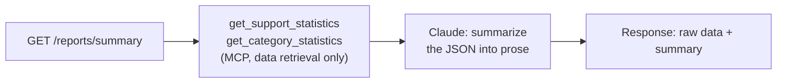

# AI Workflows

Four workflows live in `ai-service/app/workflows/`. Each one is a plain Python function that
composes MCP tool calls and (where relevant) one Claude call — no workflow talks to Chatwoot
directly. See [architecture.md](architecture.md) for how a webhook reaches these, and
[mcp-server.md](mcp-server.md) for the tool reference.

## Trigger

`ai-service` subscribes to Chatwoot's `message_created` webhook event only — not
`conversation_created`. Every classify-worthy conversation already has a first message, so
`conversation_created` would be redundant; more importantly, `create_internal_note` and
`create_draft_response` (§D below) *also* fire `message_created`, since a private note is still
a message. The webhook handler filters to `message_type == "incoming"` (sent by the customer, not
an agent or the AI itself) and `private == false` — without that filter, the AI's own notes
would trigger another classification pass on themselves. See
[`docker-compose.yml`/`scripts/configure_chatwoot.py`](../scripts/configure_chatwoot.py) for
the actual subscription.

## Shared: classification

Spam detection, categorisation, and escalation are all facets of a **single Claude call**, not
three separate ones — the brief's example JSON (§5) bundles `category`, `spam`,
`requires_human`, `confidence`, `reason`, and `draft_response` into one structured result, which
maps to one round-trip instead of three. `ai-service/app/claude_client.py` implements this as a
forced tool call (`tool_choice` pinned to a `record_classification` tool), so the model's output
is schema-constrained rather than free-text JSON the code has to hope is well-formed — see
[ADR 0001, D7](adr/0001-architecture-and-tech-stack.md#d7-structured-claude-output-via-forced-tool-use-not-prompt-embedded-json).
The prompt includes the conversation's messages plus knowledge-base context so the model can
ground `reason` and `draft_response` in real product context instead of guessing. That context
comes from real semantic search (`app/rag_client.py` → `rag-mcp`, pgvector + local embeddings —
see [ADR 0006](adr/0006-knowledge-base-rag.md)) when configured, falling back to the original
flat file dump (`app/knowledge.py`) otherwise. When configured, the prompt also includes real
matches from Jira and/or Azure DevOps (`app/grounding.py`, searched using the first customer
message as a short query) — see [ADR 0004](adr/0004-issue-tracker-grounding.md). All three
context sources are optional and independent; any outage degrades to "no extra context from that
source," never a blocked classification.

```json
{
  "category": "Crash",
  "spam": false,
  "requires_human": true,
  "confidence": 0.94,
  "reason": "Customer reports a repeatable crash exporting a report over 10,000 rows — matches known issue KI-014.",
  "draft_response": "Hi! Thanks for the report — this is a known issue (KI-014) our team is actively working on. ..."
}
```

## A. Spam detection

```mermaid
flowchart LR
    A[New conversation] --> B[Classify]
    B -->|spam=true| C[Tag "spam"<br/>set status pending]
    B -->|spam=false| D[Continue to categorisation]
```

`workflows/spam.py` reads the `spam` field off the shared classification result. Spam is
**never deleted** — it's tagged and moved out of the default open queue (`pending` status), per
brief §3.A ("should not automatically delete customer messages"). A human can always find and
correct a false positive.

## B. Automatic categorisation

`workflows/categorize.py` reads the `category` field and writes it as both a Chatwoot label
(for filtering/search in the Chatwoot UI) and a custom attribute `ai_category` (for structured
querying by the reporting workflow). The category list itself lives in ai-service configuration
(`SUPPORT_CATEGORIES`, a comma-separated env var — default: `Bug, Crash, Technical,
Installation, Account, Performance, Billing, Feedback, Other, Spam`), never hardcoded in the MCP
server or the prompt-building code, so adding a category is a config change, not a code change.

## C. AI-generated reporting



`workflows/reporting.py` deliberately keeps two functions with no shared state:
`fetch_report_data()` calls the two MCP reporting tools and returns plain JSON; a second,
independent call sends that JSON to Claude for a prose summary. Per brief §3.C ("Separate data
retrieval from LLM summarisation"), the HTTP endpoint composes both but either can be used, or
replaced, alone — e.g. `GET /reports/summary?raw=true` returns the data with no Claude call at
all.

## D. Human escalation + draft response

```mermaid
flowchart LR
    A[Classify] --> B{requires_human?}
    B -->|yes| C[Tag "human-escalated"<br/>create_internal_note with reason]
    C --> D{draft_response present?}
    D -->|yes| E["create_draft_response<br/>(private note, tag ai-draft)"]
    B -->|no| F[No escalation —<br/>conversation stays in normal queue]
```

`workflows/escalate.py` never sends anything to the customer. `requires_human=true` adds the
`human-escalated` label and a private note explaining *why* (the model's `reason` field) so an
agent doesn't have to re-derive the classification. If the model also produced a
`draft_response`, it's stored via `create_draft_response` — a private note an agent can copy
into a real reply, edit, or discard. This started as the brief's v1 constraint (§3.D, §10) and is
now a **permanent** one, independent of confidence or any other signal — see
[ADR 0005](adr/0005-no-direct-ai-to-customer-interface.md). The AI never sends a customer-facing
response, full stop; it drafts, a human decides.

## Idempotency

Every workflow run starts by reading `ai_last_processed_message_id` off the conversation's
custom attributes via `get_conversation` and comparing it to the incoming webhook's message id;
a match means this event (or a Chatwoot webhook retry of it) was already handled, and the
workflow exits without calling Claude again. On success, the workflow writes the new message id
back via `set_conversation_attributes`. See
[ADR 0001, D5](adr/0001-architecture-and-tech-stack.md#d5-idempotency-via-a-chatwoot-custom-attribute-not-a-local-database)
for why this lives in Chatwoot rather than a local database.

## Error handling

- **Malformed/invalid Claude output** (missing required field, or the model declining to call
  the classification tool): the workflow logs a structured error, falls back to
  `category="Other"`, `requires_human=true`, and skips the draft — i.e. it degrades to "a human
  should look at this," never to silently doing nothing.
- **Claude API failure** (timeout, 5xx, rate limit): retried once with backoff, then the same
  fallback as above.
- **MCP tool call failure**: MCP tools return a structured `{"error": true, ...}` rather than
  raising, so a failed write is visible in logs without crashing the webhook handler; the
  handler responds `200` to Chatwoot regardless (so Chatwoot doesn't retry-storm a webhook that
  Chatwoot itself delivered successfully) and logs the failure for operator visibility.
