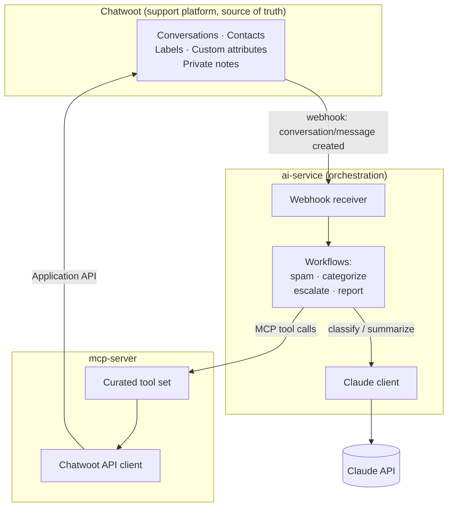
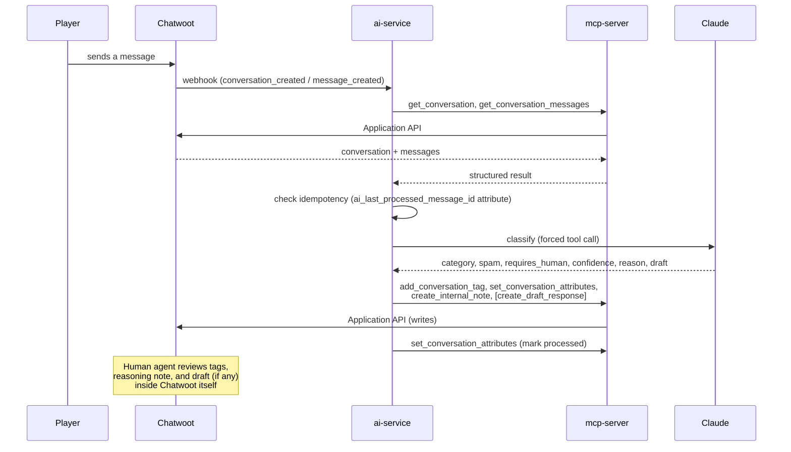

# Architecture

## Overview

This project has three independently deployable pieces, plus one piece of state they all agree
to treat as authoritative:

The **only** thing every piece agrees on is Chatwoot's own data model (conversations, labels,
custom attributes, private notes). Nothing is duplicated into a second database.

## Why this shape

The core architectural principle (see the top-level [README](../README.md) and
[ADR 0001](adr/0001-architecture-and-tech-stack.md)) is that **the AI layer is independent from
Chatwoot**, and Claude is a replaceable intelligence provider inside that AI layer — not baked
into Chatwoot or the MCP server. Concretely:

- **Chatwoot** never talks to Claude, never talks to the MCP server, and has zero code changes
  from stock Chatwoot Community Edition. It only fires webhooks it would fire regardless of
  whether anything is listening.
- **mcp-server** never talks to Claude and has no idea what "spam," "category," or "escalation"
  mean as concepts — it exposes generic Chatwoot operations (get/search conversations, tag,
  set attributes, add a private note) and nothing more. See [mcp-server.md](mcp-server.md) for
  the full tool list.
- **ai-service** is the only component that knows about Claude *and* about game-support
  business logic (what a category is, when to escalate, what "spam" means for this product). It
  reaches Chatwoot exclusively through MCP tool calls — never a direct Chatwoot API call — so
  swapping the MCP server implementation, or pointing it at a different support platform
  entirely, doesn't touch ai-service's workflow code.

Each arrow above is a network boundary (HTTP/webhook, MCP, or the Anthropic API) precisely
because each of Chatwoot, Claude, and the MCP server needs to be replaceable without redesigning
the others.

## Request flow (new conversation)

No player-facing message is ever sent automatically — the only mutations in this flow are tags,
custom attributes, and *private* notes, all of which are agent-only until a human acts.

## Components

| Component | Language/framework | Talks to | Deploys as |
|---|---|---|---|
| Chatwoot | Ruby on Rails (upstream, unmodified) | Postgres, Redis | Official Docker image |
| ai-service | Python, FastAPI | Chatwoot (webhooks in), mcp-server (MCP out), Claude (Anthropic API) | Docker container; Cloud Run-compatible |
| mcp-server | Python, `fastmcp` | Chatwoot (Application API) | Docker container; Cloud Run-compatible (stateless Streamable HTTP) |

See [ADR 0001](adr/0001-architecture-and-tech-stack.md) for the reasoning behind each of these
choices, including why the MCP server specifically avoids the SSE transport and any server-side
session state.

## Replaceability, concretely

- **Swap Chatwoot** for another support platform: rewrite `mcp-server/app/chatwoot_client.py`
  and the tool implementations in `mcp-server/app/tools.py` to the new platform's API. Tool
  *signatures* (`get_conversation`, `add_conversation_tag`, etc.) stay the same, so ai-service
  needs no changes.
- **Swap Claude** for another LLM: rewrite `ai-service/app/claude_client.py`. The rest of
  ai-service works against the same `ClassificationResult` Pydantic model regardless of which
  provider produced it.
- **Swap the MCP server implementation**: as long as the new implementation exposes the same
  tool names and shapes, ai-service's `mcp_client.py` doesn't change.

## Future integration direction (not implemented)

The brief's future-scope QA integration (player report → known issue → QA MCP → regression test
→ bug tracker) is intentionally not built here. The point of keeping Chatwoot, the AI layer, and
the MCP server separate — rather than, say, having ai-service call Chatwoot directly — is that a
future QA MCP server could sit alongside this support MCP server as a peer, with ai-service (or
a future orchestrator) calling both without either support system knowing the other exists.
